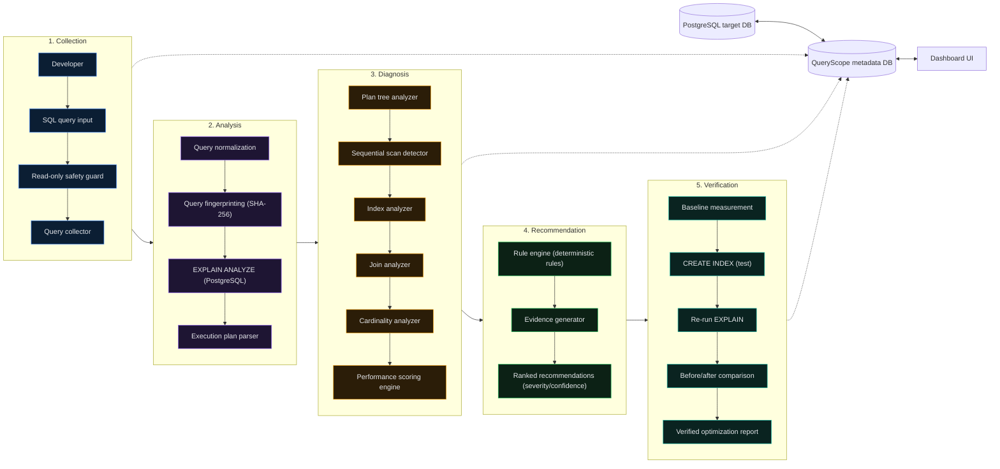

# QueryScope

**Automatic SQL query performance analyzer & optimizer — turns a slow query into a proven, evidence-backed fix.**

[]()
[]()
[]()
[]()
[](LICENSE)


---

## The problem

A developer knows a query is slow. Most tools stop at "here's the EXPLAIN output, good luck." **QueryScope goes further**: it parses the execution plan, runs it through a deterministic rule engine, and — critically — *proves* each recommendation actually helps by testing it in a rolled-back transaction before suggesting you ship it.

No LLM guesswork. No "trust me." Every recommendation comes with the query plan evidence behind it.

## What it does

-  **Reads execution plans, not just queries** — parses `EXPLAIN (ANALYZE, BUFFERS, FORMAT JSON)` into a full plan tree
-  **Deterministic diagnosis engine** — rule-based detection of sequential scans, cardinality misestimates, expensive joins, and query hygiene issues (`SELECT *`, missing `WHERE`, unbounded `ORDER BY`)
-  **Verifies before recommending** — tests candidate indexes with `BEGIN → CREATE INDEX → EXPLAIN → ROLLBACK`, so nothing touches production and every suggestion is backed by a real before/after comparison
-  **Transparent scoring** — a multi-dimensional performance score, not a black-box number
-  **Safe by design** — read-only query validation, multi-statement blocking, destructive-keyword rejection
-  **Dashboard UI** — query leaderboard, health overview, one-click "verify optimization"

## Architecture



## Tech stack

| Layer | Technology |
|---|---|
| Backend | Java 17, Spring Boot 3.2, Spring Data JPA, Flyway |
| Database | PostgreSQL 16 (target DB + metadata DB) |
| Frontend | HTML/CSS/JS dashboard, served via Nginx |
| Infra | Docker Compose (4-service stack: target-db, metadata-db, backend, frontend) |
| Analysis | Postgres `EXPLAIN (ANALYZE, BUFFERS, FORMAT JSON)`, SHA-256 query fingerprinting |

## See it in action

```sql
-- Missing composite index on (customer_id, created_at)
SELECT * FROM orders
WHERE customer_id = 123
AND created_at > '2026-01-01';
```

QueryScope flags the sequential scan, estimates the scan amplification, recommends a composite index — then actually creates it inside a transaction, re-runs `EXPLAIN`, measures the real before/after difference, and rolls the index back. You get proof, not a guess.

```bash
curl -X POST http://localhost:8080/api/analyze \
  -H 'Content-Type: application/json' \
  -d '{"sql":"SELECT * FROM orders WHERE customer_id = 123 AND created_at > '\''2026-01-01'\''"}'
```

## Detection rules (v0.1)

| Rule | What it catches |
|---|---|
| `SEQ_SCAN_HIGH_SELECTIVITY` | Sequential scan on a large table with high scan amplification |
| `CARDINALITY_ESTIMATION` | Large gap between the planner's row estimate and actual rows |
| `SELECT_STAR` | Query hygiene issue — low severity |
| `EXPENSIVE_JOIN` | Join nodes fed by sequential scans |

## Quick start

**Fastest — no Docker/Java needed:**
```bash
cd /path/to/QueryScope
./scripts/run_local.sh
```
Open **http://localhost:3000** and click **Run Analysis**. Spins up a local Python server with a built-in SQLite demo database (80K orders, intentional missing indexes).

**Full stack (PostgreSQL + Spring Boot):**
```bash
./scripts/start.sh
```
| Service | URL |
|---|---|
| Dashboard | http://localhost:3000 |
| API | http://localhost:8080 |
| Target DB (shop) | localhost:5433 |
| QueryScope metadata DB | localhost:5434 |

## API endpoints

| Method | Path | Description |
|---|---|---|
| `POST` | `/api/analyze` | Analyze a SQL query |
| `GET` | `/api/dashboard/overview` | Health overview stats |
| `GET` | `/api/dashboard/queries` | Query pattern leaderboard |
| `GET` | `/api/dashboard/jobs` | Recent analysis jobs |
| `POST` | `/api/recommendations/{id}/verify` | Run optimization experiment |

## Project structure

```text
QueryScope/
├── backend/           # Spring Boot API + analysis engine
├── frontend/          # Dashboard UI (static + nginx)
├── sample-db/         # Target database schema + seed data
└── docker-compose.yml
```

## Security model

- Only `SELECT` / `WITH` queries accepted for analysis
- Multi-statement SQL blocked
- Destructive keywords rejected (`DROP`, `DELETE`, `UPDATE`, etc.)
- Verification uses `BEGIN → CREATE INDEX → EXPLAIN → ROLLBACK` — never modifies production permanently

## Roadmap

- [ ] `pg_stat_statements` workload ingestion
- [ ] N+1 query pattern detection
- [ ] Plan change regression detection
- [ ] Incident mode (latency spike alerts)
- [ ] Optional LLM narrative layer on top of deterministic evidence

## Troubleshooting

| Problem | Fix |
|---|---|
| `docker.sock: no such file` | Open Docker Desktop and wait until running |
| `docker compose up` hangs on pull | Check internet, or use `./scripts/run_local.sh` instead |
| `Unable to locate a Java Runtime` | Use `./scripts/run_local.sh` (no Java needed) |
| Dashboard loads but analyze fails | Ensure server is running on port 3000 |
| Port 3000 already in use | `lsof -ti:3000 \| xargs kill -9` then restart |

## License

MIT — see [LICENSE](LICENSE).
